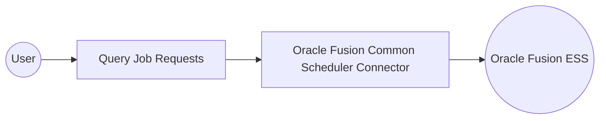

# Example

## What you'll build

Build an automation that reports on the scheduled processes currently running in Oracle Fusion Cloud. The integration connects to the Enterprise Scheduler Service (ESS), queries job requests with a filter, and logs how many are running. It's a starting point for monitoring long-running imports, reports, and period-close processes.

**Operations used:**
- **Query Job Requests** : Retrieves scheduled process job requests that match a filter, sorted by a field you specify.

## Architecture

## Prerequisites

- An Oracle Fusion Cloud Applications instance on release 23B or later, with the Enterprise Scheduler Service REST API enabled.
- An OAuth 2.0 client credentials application registered in Oracle Identity Cloud Service, with its token URL, client ID, and client secret.

## Setting up the Oracle Fusion Common Scheduler integration

> **New to WSO2 Integrator?** Follow the [Create a New Integration](../../../../develop/create-integrations/create-a-new-integration.md) guide to set up your integration first, then return here to add the connector.

## Adding the Oracle Fusion Common Scheduler connector

### Step 1: Open the connector palette

Select **Add Connection** in the **Connections** section.

### Step 2: Select the Scheduler connector

1. Enter `oraclefusion.common.scheduler` in the search field.
2. Select the **Scheduler** connector card.

## Configuring the Oracle Fusion Common Scheduler connection

### Step 3: Bind the connection parameters to configurable variables

Bind every connection field to a configurable variable so no credential is stored in the integration.

- **Config** : Client configuration record that carries the OAuth 2.0 client credentials for your Fusion instance.
- **Service Url** : Base URL of the Enterprise Scheduler Service REST API on your Fusion instance.
- **Connection Name** : Name that identifies this connection in the integration.

### Step 4: Save the connection

Select **Save Connection** and verify that the connection appears in the **Connections** section.

### Step 5: Set actual values for your configurables

1. Select **Configurations** at the bottom of the project tree under **Data Mappers**.
2. Enter a value for each configurable listed below before you run the integration.

- **serviceUrl** (`string`) : Base URL of the scheduler REST API, such as your Fusion host followed by the ESS request path.
- **tokenUrl** (`string`) : OAuth 2.0 token endpoint of your Oracle Identity Cloud Service tenant.
- **clientId** (`string`) : Client ID of the registered confidential application.
- **clientSecret** (`string`) : Client secret of the registered confidential application.

## Configuring the Oracle Fusion Common Scheduler Query Job Requests operation

### Step 6: Add an automation entry point

1. Select **Add Entry Point** next to **Entry Points**.
2. Select **Automation**.
3. Select **Create** to accept the settings.

### Step 7: Expand the connection and configure the Query Job Requests operation

1. Select **Add Step** in the automation flow.
2. Expand **schedulerClient** to display its operations.

3. Select **Query Job Requests**, expand **Advanced Configurations**, and enter its values.

- **Q** : SCIM-style filter that selects which job requests to return.
- **Order By** : Field and direction used to sort the results.
- **Result** : Name of the variable that holds the query response.

4. Select **Save**.

### Step 8: Log the Query Job Requests result

Add a **Log Info** step that reports the number of matching job requests, then return to the visual flow.

## Try it yourself

Try this sample in WSO2 Integration Platform.

[View source on GitHub](https://github.com/wso2/integration-samples/tree/main/integrator-default-profile/connectors/oraclefusion_common_scheduler_connector_sample)

## More code examples

The `Oraclefusion.common.scheduler` connector provides practical examples illustrating usage in various scenarios. Explore these [examples](https://github.com/ballerina-platform/module-ballerinax-oraclefusion.common.scheduler/tree/main/examples/), covering the following use cases:

1. [Submit and track job](https://github.com/ballerina-platform/module-ballerinax-oraclefusion.common.scheduler/tree/main/examples/submit-and-track-job) - Submit a scheduled process and poll the resulting request until it reaches a terminal state, then report the final execution outcome.
2. [Monitor scheduled processes](https://github.com/ballerina-platform/module-ballerinax-oraclefusion.common.scheduler/tree/main/examples/monitor-scheduled-processes) - Build an operational view over scheduled processes: list running requests, find the ones in the `ERROR` state, and drill into the most recent of those for its parameters and error detail.
