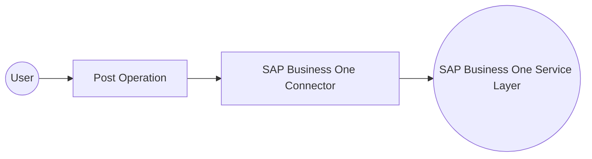

# Example

## What you'll build

This integration connects to an SAP Business One Service Layer instance using the SAP Business One connector and creates a new Business Partner record. It demonstrates configuring a connection with configurable variables and invoking a create operation from an Automation entry point.

**Operations used:**
- **Post** : Creates a new entity (such as a Business Partner) in the SAP Business One Service Layer through an HTTP POST request.

## Architecture

## Prerequisites

- A running SAP Business One Service Layer instance accessible over HTTPS.
- Valid SAP Business One credentials: company database name, username, and password.

## Setting up the SAP Business One integration

> **New to WSO2 Integrator?** Follow the [Create a New Integration](../../../../develop/create-integrations/create-a-new-integration.md) guide to set up your integration first, then return here to add the connector.

## Adding the SAP Business One connector

### Step 1: Open the connector palette
Select **+ Add Connection** in the **Connections** section to open the connector search palette.

### Step 2: Search for and select the SAP Business One connector
Search for "business one" in the palette and select the **Businessone** connector card to open the connection form.

## Configuring the SAP Business One connection

### Step 3: Configure the connection parameters
Bind each field in the connection form to a configurable variable.
- **Url** : URL of the target SAP Business One Service Layer endpoint.
- **Session** : The Service Layer session credentials record, composed from the company database, username, and password configurables.
- **Connection Name** : Identifier for this connection instance.

### Step 4: Save the connection
Select **Save Connection** to persist the connector configuration and confirm the connection appears on the canvas.

### Step 5: Set actual values for your configurables
1. Select **Configurations** in the left panel, at the bottom of the project tree under Data Mappers.
2. Set a value for each configurable listed below.
- **sapServiceLayerUrl** (string) : The URL of the SAP Business One Service Layer endpoint.
- **sapCompanyDb** (string) : The SAP Business One company database name.
- **sapUsername** (string) : The username for the SAP Business One session.
- **sapPassword** (string) : The password for the SAP Business One session.

## Configuring the SAP Business One Post operation

### Step 6: Add an Automation entry point
Add an **Automation** artifact to the design canvas to host the connector invocation, since this sample performs a standalone call with no need to react to an external event. This creates a **Start** node and an **Error Handler** block for the flow.

### Step 7: Expand the connection's operations
1. Select the **+** node between **Start** and **Error Handler** to open the step-addition panel.
2. Expand the connection entry under **Connections** to reveal all available operations.

### Step 8: Select and configure the Post operation
Select the **Post** operation and configure it to create a Business Partner record in the SAP Business One Service Layer.
- **Path** : The OData resource collection representing the target entity.
- **Message** : The record payload for the entity to create, provided as an expression.
- **Result** : The local variable that stores the operation's response.
- **Target Type** : The expected response type for data binding.

### Step 9: Verify the completed flow
Confirm the completed automation flow on the design canvas, connecting the **Start** node, the **Post** operation, and the **Error Handler**.

## Try it yourself

Try this sample in WSO2 Integration Platform.

[View source on GitHub](https://github.com/wso2/integration-samples/tree/main/connectors/sap_businessone_crm_connector_sample)

## More code examples

The SAP Business One connectors provide practical examples illustrating usage in various scenarios. Explore these
[examples](https://github.com/ballerina-platform/module-ballerinax-sap.businessone/tree/main/examples), covering
use cases like listing open sales orders, reporting inventory stock, and logging CRM activities.
